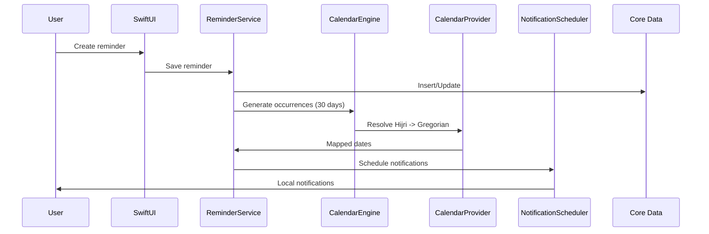
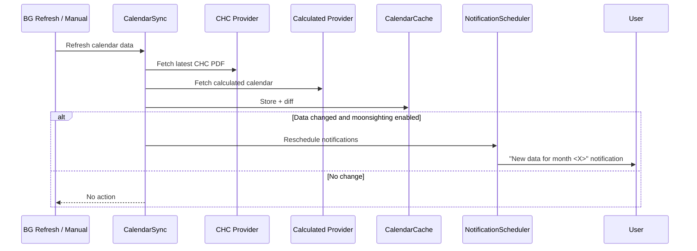
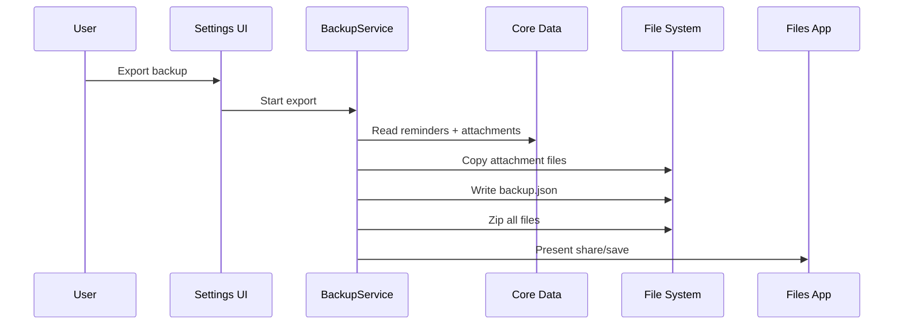
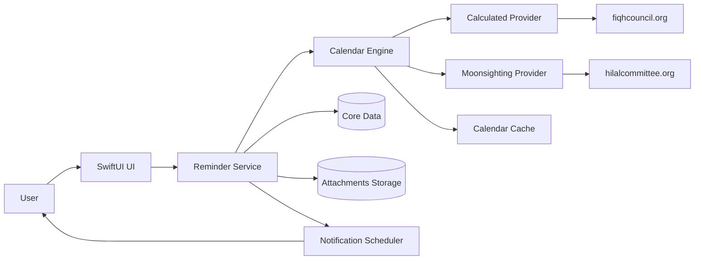

# Engineering Spec — Hijri Calendar Reminders v1

Date: February 2, 2026

## 1) Summary
An iOS 16+ SwiftUI app for Hijri-date–based reminders with user-owned notes and attachments. The app uses calculated Hijri dates by default and can optionally switch to Central Hilal Committee (CHC) moonsighting data when available. Data is stored on-device with user-initiated backup/restore via a zip export.

## 2) Scope
### In-scope (v1)
- Hijri-based reminders only (annual or one-time).
- Reminders-style UI: single list view + Hijri calendar view.
- Notes (plain text) and attachments (photos, files, links).
- Calculated dates via `fiqhcouncil.org/calendar`.
- Optional moonsighting via CHC (`hilalcommittee.org` PDF).
- Hourly refresh (best-effort) + manual refresh.
- Local notifications with a 30-day rolling schedule.
- Export to zip (JSON + attachment files).

### Out of scope (v1)
- Templates/presets for occasions.
- Curated religious content.
- Gregorian reminders.
- Multiple reminders per occasion.
- Custom notification sounds.
- Rich text notes.
- Cloud sync or sharing.

## 3) Assumptions & Constraints
- iOS local notification cap: 64 pending notifications.
- Background refresh is best-effort; app launch/manual refresh must backstop.
- CHC data is published as a PDF linked from `https://hilalcommittee.org/`.
- Calculated calendar is available from `https://fiqhcouncil.org/calendar/`.

## 4) Functional Requirements
- Create, edit, delete Hijri reminders (annual or one-time).
- Schedule notifications at user-selected time (default 12:00am).
- Multi-day reminders notify every day at the chosen time.
- Calendar view shows Hijri + Gregorian dates with markers for reminders.
- Optional moonsighting mode (off by default).
- When CHC data updates change dates, reschedule and notify user:
  - “New data available for month <X>; calendar updated.”
- Backup/export to zip: JSON + attachments.
- Restore from zip.

## 5) Non-Functional Requirements
- English only.
- All data stored on-device.
- iOS 16+ compatibility.
- Avoid blocking UI during refresh or parsing.

## 6) Architecture
### Components
- **CalendarProvider Protocol**
  - `CalculatedProvider`: fetch/parse `fiqhcouncil.org/calendar`.
  - `MoonsightingProvider`: scrape `hilalcommittee.org`, download latest PDF, parse.
- **CalendarCache**
  - Stores parsed month definitions + metadata.
- **CalendarEngine**
  - Resolves Hijri -> Gregorian using selected source.
  - Partial-month fallback: CHC for known days, calculated for remaining.
- **ReminderService**
  - CRUD reminders; generates occurrences.
- **NotificationScheduler**
  - 30-day rolling schedule; reschedules on data changes.
- **BackupService**
  - Export JSON + attachments into zip; import zip.
- **UI**
  - List view, calendar view, reminder editor, settings.

## 7) Data Model (Core Data)
### Reminder
- `id: UUID`
- `title: String`
- `hijriMonth: Int` (1-12)
- `hijriDay: Int` (1-30)
- `hijriYear: Int?` (nil for annual)
- `recurrence: String` ("annual" | "one-time")
- `timeHour: Int` (0-23)
- `timeMinute: Int` (0-59)
- `durationDays: Int` (>= 1)
- `notesText: String?`
- relationship: `attachments` (to-many)

### Attachment
- `id: UUID`
- `type: String` ("photo" | "file" | "link")
- `path: String?` (for photo/file)
- `url: String?` (for link)
- `displayName: String?`
- `createdAt: Date`
- relationship: `reminder` (to-one)

### CalendarCache
- `source: String` ("calculated" | "moonsighting")
- `lastFetchAt: Date`
- `payload: Data` (serialized month definitions)

### Settings
- `moonsightingEnabled: Bool`
- `lastCalendarRefresh: Date?`

## 8) Data Sources & Parsing
### Calculated (Fiqh Council)
- Fetch HTML from `https://fiqhcouncil.org/calendar/`.
- Parse month tables to extract:
  - Hijri year/month
  - Gregorian start date
  - Month length

### Moonsighting (CHC)
- Scrape `https://hilalcommittee.org/` for latest calendar PDF link.
- Download PDF and parse month definitions.
- Parsing must tolerate layout changes and fail gracefully.

## 9) Calendar Resolution Rules
- If moonsighting enabled:
  - Use CHC data when available for the month.
  - Use calculated data for unknown days/months.
- If moonsighting disabled:
  - Use calculated data only.
- Users see only the active source (no side-by-side display).

## 10) Notification Scheduling
- Generate occurrences for the next 30 days only.
- Schedule local notifications for each occurrence.
- Reschedule on:
  - Reminder CRUD changes
  - Calendar refresh with changed mapping
  - App launch
- Standard iOS notification sound.

## 11) Refresh Strategy
- On app launch: refresh calendar data if stale.
- Manual refresh in settings.
- Background refresh task:
  - Best-effort hourly using BGAppRefreshTask.

## 12) Backup & Restore
- Export `.zip` containing:
  - `backup.json` (reminders, attachments metadata)
  - `attachments/` directory with files
- Restore by importing zip, validating JSON, and re-linking files.

### Export JSON (example)
```json
{
  "version": 1,
  "reminders": [
    {
      "id": "UUID",
      "title": "Zakat Due",
      "hijriDate": { "year": null, "month": 9, "day": 1 },
      "recurrence": "annual",
      "time": "00:00",
      "durationDays": 1,
      "notesText": "...",
      "attachments": [
        {
          "id": "UUID",
          "type": "file",
          "path": "attachments/uuid.pdf",
          "displayName": "zakat.pdf"
        }
      ]
    }
  ]
}
```

## 13) Sequence Diagrams

### Create Reminder & Schedule Notifications


### Hourly Refresh with CHC Update


### Backup Export


## 14) Data Flow Diagram


## 15) Error Handling
- Parsing failures fall back to calculated data when possible.
- Network failures show non-blocking error and keep cached data.
- Export/import validation errors show actionable messages.

## 16) Privacy & Security
- All user data stored locally.
- Export files are user-managed; app does not upload any data.
- No analytics in v1.

## 17) Testing Strategy
- Unit tests for parsing (HTML + PDF fixtures).
- Unit tests for Hijri -> Gregorian mapping.
- Integration tests for notification scheduling.
- Manual QA for background refresh behavior.

## 18) Open Questions
- None (v1 requirements locked).
